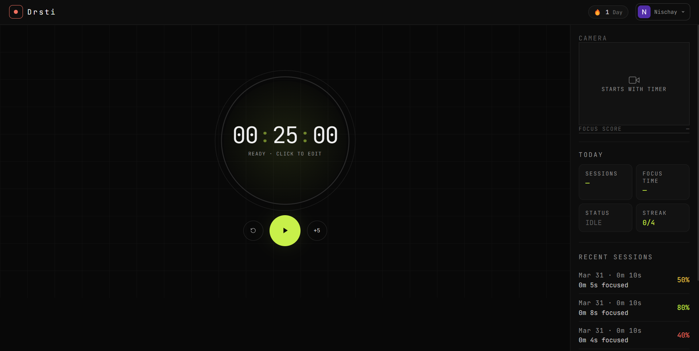
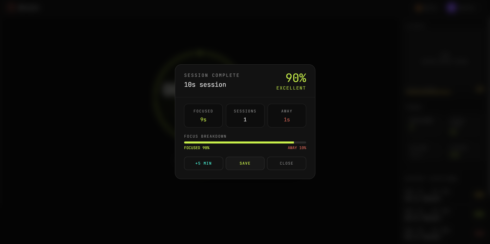
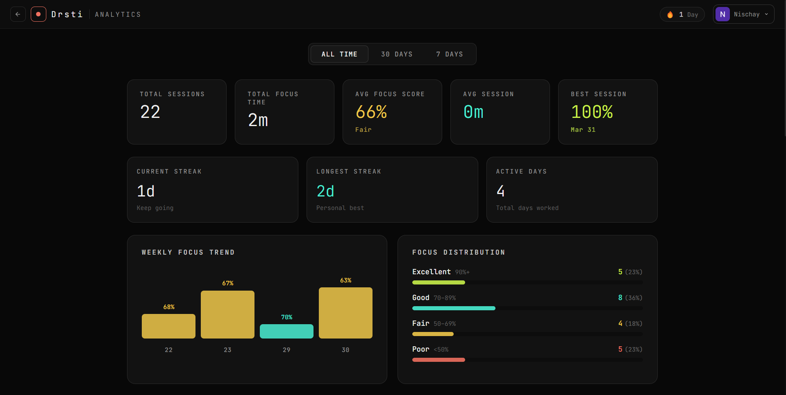
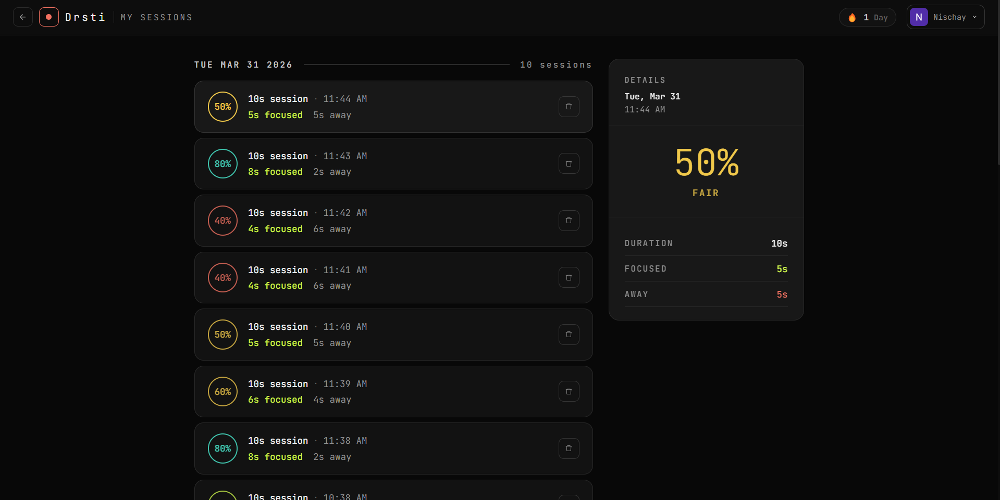

# Drsti

> AI-powered focus intelligence for your desktop. Real-time gaze detection that tells you exactly when you're working and when you drift — down to the second.

[](https://github.com/NischayRT/drsti/releases)
[](https://electronjs.org)
[](https://nextjs.org)
[](https://python.org)
[](https://developers.google.com/mediapipe)
[](https://supabase.com)
[](LICENSE)

---
## Download

[](https://github.com/NischayRT/Drsti/releases/download/v1.0.0/Drsti-Setup-1.0.0.exe)

[View all releases](https://github.com/NischayRT/Drsti/releases/tag/v1.0.0)

---

## What is Drsti?

Drsti is a desktop productivity application that uses your webcam and a local AI model to measure focus in real time. Unlike traditional Pomodoro timers that assume you are working during a session, Drsti actually detects whether you are looking at your screen — and records the exact seconds you were focused vs away.

**The AI runs entirely on your machine. No frames, no video, no biometric data ever leaves your device.**

---

## Features

| # | Feature | What it does |
|---|---|---|
| 1 | Real-time gaze detection | 468 facial landmarks tracked every 2s — knows if you're actually looking at your screen |
| 2 | Honest focus scoring | Rolling 30-sample window produces a live 0–100 score based on where your eyes are |
| 3 | Distraction alerts | One beep when you drift, one when you return — no popups, no mid-thought interruptions |
| 4 | Pomodoro timer | Focus sessions, short breaks, long breaks — all configurable with click-to-edit durations |
| 5 | Session reports | Focused time, away time, focus %, and a minute-by-minute timeline chart every session |
| 6 | 100% local AI | MediaPipe FaceMesh runs on your CPU — no cloud, no data leaving your machine |
| 7 | Google sign-in | One-click OAuth, sessions saved to your personal account, accessible on desktop and web |
| 8 | Analytics dashboard | Weekly trends, daily focus time, best-hours heatmap, focus distribution, scatter plot |
| 9 | Streak tracking | Current streak, longest streak, active days — accountability that actually sticks |
| 10 | Dark and light theme | Full CSS variable system, instant switch from settings, persists between launches |
| 11 | Adjustable AI sensitivity | Strict, balanced, or relaxed — choose how aggressively the AI flags head movements |
| 12 | Break timer with countdown | Sub-timers for short/long breaks with a 10-second return countdown and audio alert |
| 13 | Session history | Full history with per-session detail panels, minute-by-minute charts, delete support |
| 14 | Works without AI | Full Pomodoro timer and audio system works even if the Python API is offline |
| 15 | One installer, no setup | Python, MediaPipe, and the AI model bundled into a single .exe — just install and open |

---

## Screenshots






---

## Table of Contents

- [How It Works](#how-it-works)
- [The AI Agent](#the-ai-agent)
- [Privacy & Safety](#privacy--safety)
- [Tech Stack](#tech-stack)
- [Project Structure](#project-structure)
- [Development Setup](#development-setup)
- [Building for Production](#building-for-production)
- [Database Schema](#database-schema)
- [API Reference](#api-reference)
- [Detection Thresholds](#detection-thresholds)
- [Roadmap](#roadmap)

---

## How It Works

```
1. User starts focus timer
         ↓
2. Webcam activates (OS camera indicator turns on)
         ↓
3. Every 2 seconds:
   WebcamPreview.jsx captures a JPEG frame via <canvas>
   → base64 encoded → POST to localhost:5000/analyze
         ↓
4. Flask server decodes frame → OpenCV → BGR numpy array
         ↓
5. MediaPipe FaceMesh processes the array
   → 468 facial landmark coordinates (normalized 0–1)
         ↓
6. GazeEstimator extracts:
   - Head yaw  (left/right turn, from nose-to-eye ratios)
   - Head pitch (up/down tilt, from nose-to-chin angle)
   - Eye Aspect Ratio (EAR, from eyelid landmark distances)
         ↓
7. Threshold check:
   |yaw| > 25° OR |pitch| > 20° OR EAR < 0.18 OR no face
   → mark second as "AWAY"
         ↓
8. ScoreCalculator updates rolling 30-sample window
   → returns focus_score (0–100), should_nudge (bool)
         ↓
9. React UI updates live:
   - Status pill: FOCUSED / DISTRACTED
   - Focus score bar
   - Yaw / pitch readout on camera overlay
         ↓
10. On distraction state change:
    - Electron desktop notification fires
    - Distraction beep plays (440→280Hz, descending)
    On refocus state change:
    - Electron desktop notification fires
    - Refocus beep plays (440+660Hz, ascending double)
         ↓
11. Session ends → report generated:
    focus_time = elapsed - away_seconds
    focus_pct  = (focus_time / duration) × 100
         ↓
12. User saves → POST to Supabase sessions table
    (metadata only — never video or biometrics)
```

---

## The AI Agent

### Model

Drsti uses **MediaPipe Face Landmarker** (`face_landmarker.task`, float16, ~29MB) — an open-source model from Google, publicly available at:

```
https://storage.googleapis.com/mediapipe-models/face_landmarker/face_landmarker/float16/1/face_landmarker.task
```

This model detects **468 facial landmarks** in a single RGB image. FocusGuard uses **8 of them** for gaze and eye signals, and ignores the remaining 460.

### Signal extraction

**Head yaw (left/right rotation)**
```python
NOSE_TIP    = 1
LEFT_EYE_L  = 226
RIGHT_EYE_R = 446

nose_to_left  = abs(nose.x - left_eye.x)
nose_to_right = abs(nose.x - right_eye.x)
yaw = (nose_to_right / (nose_to_left + nose_to_right) - 0.5) * 90
```

**Head pitch (up/down tilt)**
```python
CHIN = 152
dy    = chin.y - nose.y
pitch = degrees(atan2(nose.x - chin.x, dy))
```

**Eye Aspect Ratio (EAR)**
```python
# Landmarks: top (159), bottom (145), left (33), right (133)
EAR = distance(top, bottom) / distance(left, right)
# Open eye: 0.25–0.35 · Closed: < 0.18
```

### What the AI does NOT do

- Read emotions or expressions
- Identify who you are
- Store or transmit any video or frames
- Train on your data or adapt over time
- Run when the timer is not active
- Make network requests of any kind

---

## Privacy & Safety

| Guarantee | Detail |
|---|---|
| No video stored | Frames are analyzed in <200ms then discarded. No recording, no temp files. |
| No cloud inference | AI runs on your CPU locally. No frame ever touches an external server. |
| No biometrics saved | Sessions store only: duration, focus_time, focus_pct, breaks_taken, timeline. No face data. |
| Camera off when idle | Webcam activates only when the timer runs. Pausing stops it immediately. |
| Open thresholds | Yaw, pitch, and EAR thresholds are documented, adjustable, and deterministic. |
| Row-level security | All Supabase data is protected by RLS — users can only access their own rows. |

---

## Tech Stack

| Layer | Technology | Version | Purpose |
|---|---|---|---|
| Desktop shell | Electron | 28 | Native window, IPC, Python process lifecycle, deep links |
| UI renderer | Next.js | 15 (App Router) | React UI running inside Electron |
| Styling | Tailwind CSS | v3 | Utility-first CSS with light/dark theme variables |
| Font | JetBrains Mono | — | Monospaced display font throughout |
| AI model | MediaPipe Face Landmarker | float16 | 468-point facial landmark detection |
| Computer vision | OpenCV | 4.x | Frame decoding and color space conversion |
| AI server | Flask | 3.0 | Local HTTP server at localhost:5000 |
| Numerical | NumPy | 2.x | Landmark coordinate math |
| Bundler | PyInstaller | 6.x | Bundles Python + model into single .exe |
| Installer | electron-builder | 24 | Produces .exe (NSIS) installer |
| Auth + DB | Supabase | — | Google OAuth + Postgres session storage |

---

## Project Structure

```
drsti/
│
├── electron/
│   ├── main.js          # Window, Python process, IPC, OAuth deep links
│   ├── preload.js       # Context bridge — exposes electronAPI to renderer
│   └── splash.html      # Loading screen while Python API starts
│
├── renderer/            # Next.js 15 app (runs inside Electron)
│   ├── next.config.mjs  # Static export config (output: 'export')
│   ├── tailwind.config.ts
│   ├── .env.local       # Supabase keys — never committed
│   └── src/
│       ├── app/
│       │   ├── layout.js
│       │   ├── page.js           # Main app — timer + sidebar
│       │   ├── globals.css       # CSS variables for light/dark theme
│       │   ├── history/page.jsx  # Full session history screen
│       │   └── analytics/page.jsx # Analytics dashboard
│       ├── components/
│       │   ├── Timer.jsx         # Pomodoro timer with break sub-timers
│       │   ├── WebcamPreview.jsx # Camera feed, frame sampling, API calls
│       │   ├── Sidebar.jsx       # Today stats, session history, settings
│       │   ├── ReportOverlay.jsx # End-of-session modal with charts
│       │   ├── AuthButton.jsx    # Google sign-in, OAuth deep link handler
│       │   ├── Onboarding.jsx    # First-launch walkthrough
│       │   └── SettingsPanel.jsx # Duration, sensitivity, sound, theme
│       └── lib/
│           ├── audio.js     # Web Audio API — beeps, chimes, alerts
│           ├── supabase.js  # Supabase client, session helpers
│           └── settings.js  # localStorage-backed settings context
│
├── python-api/
│   ├── app.py            # Routes: /health /analyze /session/start /session/end
│   ├── gaze_estimator.py # MediaPipe landmark detection + gaze math
│   ├── score_calculator.py # Rolling focus score, nudge trigger
│   ├── requirements.txt
│   ├── focusguard.spec   # PyInstaller build spec
│   └── face_landmarker.task # Auto-downloaded on first run (~29MB)
│
├── scripts/
│   ├── build.bat         # Windows production build
│   └── build.sh          # Mac/Linux production build
│
├── assets/icon.ico
├── package.json
├── .gitignore
└── README.md
```

---

## Development Setup

### Prerequisites

Node.js 18+ · Python 3.10–3.13 · Git

### Steps

```bash
# 1. Clone
git clone https://github.com/NischayRT/drsti.git
cd drsti

# 2. Install root dependencies
npm install

# 3. Install renderer dependencies
cd renderer && npm install && cd ..

# 4. Set up Python environment
cd python-api
python -m venv venv
source venv/Scripts/activate   # Windows
pip install flask flask-cors mediapipe opencv-python numpy
cd ..

# 5. Add environment variables
# Create renderer/.env.local:
# NEXT_PUBLIC_SUPABASE_URL=https://your-project.supabase.co
# NEXT_PUBLIC_SUPABASE_ANON_KEY=your-anon-key

# 6. Run Supabase schema (once)
# Paste renderer/supabase-setup.sql into Supabase SQL Editor

# 7. Run in development
# Terminal 1:
cd python-api && source venv/Scripts/activate && python app.py

# Terminal 2:
npm run dev
```

---

## Building for Production

```bash
# Windows
scripts\build.bat
```

Or step by step:

```bash
# Next.js static export
cd renderer && npm run build && cd ..

# Bundle Python API
cd python-api
source venv/Scripts/activate
pyinstaller focusguard.spec --clean --noconfirm
cd ..

# Package with electron-builder
npx electron-builder --win
```

Output: `dist/Drsti-Setup-1.0.0.exe`

---

## Database Schema

```sql
create table sessions (
  id           uuid primary key default gen_random_uuid(),
  user_id      uuid references auth.users(id) on delete cascade,
  created_at   timestamptz default now(),
  duration     int,          -- total timer seconds
  focus_time   int,          -- seconds classified as focused
  focus_pct    int,          -- 0–100
  distractions int,          -- reserved
  breaks_taken int default 0,
  mode         text,         -- 'focus'
  timeline     jsonb         -- [{minute, focus_pct}]
);

alter table sessions enable row level security;

create policy "users own sessions"
  on sessions for all
  using (auth.uid() = user_id);
```

---

## API Reference

Local server at `http://localhost:5000`.

### `GET /health`
```json
{ "status": "ok", "model": "mediapipe-facemesh" }
```

### `POST /analyze`
```json
// Request
{ "frame": "data:image/jpeg;base64,..." }

// Response
{
  "face_detected": true,
  "looking_away": false,
  "eyes_closed": false,
  "yaw": -3.24,
  "pitch": 1.87,
  "left_ear": 0.312,
  "right_ear": 0.298,
  "focus_score": 88,
  "should_nudge": false,
  "session_focus_pct": 91
}
```

### `POST /session/start`
Resets the rolling score calculator. Call when a new focus session begins.

### `POST /session/end`
Returns full session stats including per-minute timeline array.

---

## Detection Thresholds

Configurable in Settings → AI Sensitivity.

| Signal | Strict | Balanced (default) | Relaxed |
|---|---|---|---|
| Head yaw | ±15° | ±25° | ±35° |
| Head pitch | ±10° | ±20° | ±30° |
| Eye aspect ratio | < 0.20 | < 0.18 | < 0.15 |

---

## Roadmap

- [x] Phase 1 — Windows installer (.exe)
- [x] Phase 2 — Onboarding, settings, light/dark theme
- [x] Phase 3 — Analytics dashboard (5 charts, heatmap, streak)
- [ ] Phase 4 — Auto-updater, error reporting, beta release
- [ ] Phase 5 — Personal gaze calibration
- [ ] Mac (.dmg) and Linux (.AppImage) builds
- [ ] Chrome extension port (MediaPipe WASM)

---

Built by **Nischay Reddy Thigulla** — [GitHub](https://github.com/NischayRT)